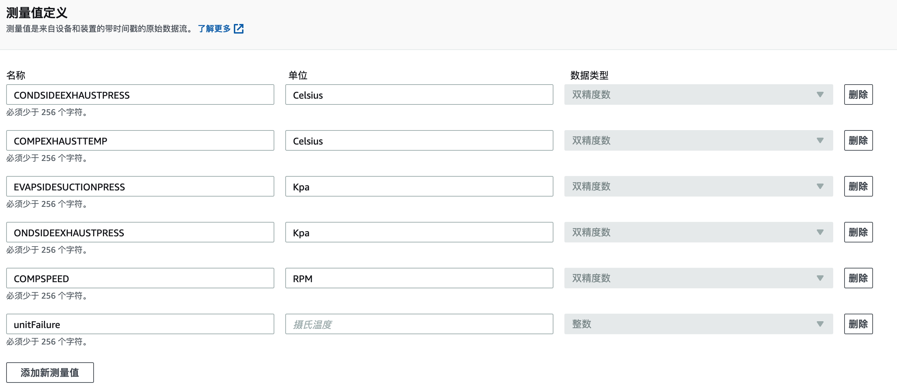
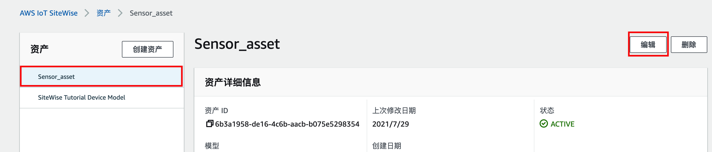
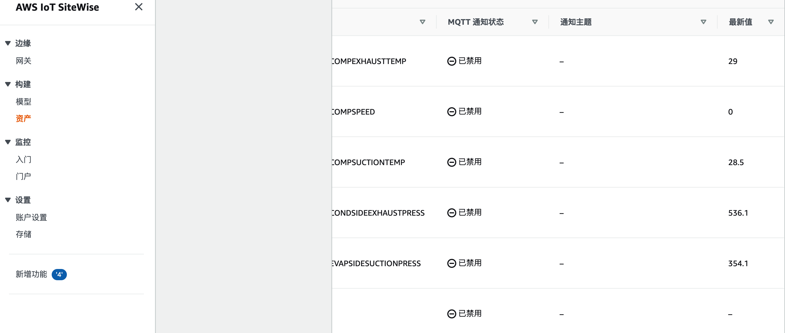

AWS IoT SiteWise Monitor 是AWS IoT SiteWise 服务提供的应用程序门户。通过 SiteWise Monitor，您可以在几分钟内迅速发布带有资产数据的 Web 应用程序，并向工业工程师提供可见性，以对问题作出反应或识别不同设施之间的差异。SiteWise Monitor 可以轻松地创建集中式、权威性的信息源，以便更好地了解您的操作、改进流程并减少整个组织的浪费。

这里我们使用AWS IoT SiteWise Monitor来对传感器的这些指标进行监控:
包括

- 压缩机吸气温度sensor_1_COMPSUCTIONTEMP
- 压缩机排气温度sensor_1_COMPEXHAUSTTEMP
- 蒸发器侧压力/吸气压力 sensor_1_EVAPSIDESUCTIONPRESS
- 冷凝器侧压力(排气压力)sensor_1_CONDSIDEEXHAUSTPRESS
- 压缩机转速 sensor_1_COMPSPEED
- 机组有故障发生 unitFailure

接下来,我们进入 [AWS IoT SiteWise 控制台](https://console.aws.amazon.com/iotsitewise/home?region=us-east-1#),在左侧找到"≡"标志并点击展开

#### 创建模型

在构建下找到模型选项,点击创建模型转到创建模型页面,进行以下配置

   1. 在模型详细信息中
    - 名称一栏输入自定义的模型名称 例如 "Sensor_Model"
    - 描述(可选)一栏中输入对此模型的描述例如"Sensor Model For Device Sensor"
   2. 在测量值定义中,按下述表格进行配置

| 名称 | 单位 | 数据类型 |
| ----- | :-: | ---: |
| COMPSUCTIONTEMP    | Celsius |  双精度数 |
| COMPEXHAUSTTEMP    | Celsius |  双精度数 |
| EVAPSIDESUCTIONPRESS    | Kpa |  双精度数 |
| CONDSIDEEXHAUSTPRESS    | Kpa |双精度数 |
| COMPSPEED    | RPM |  双精度数 |
| unitFailure    |  |  整数 |
  
   3. 其余保持默认或留空

#### 创建资产

在左侧构建下方找到**资产**选项,点击创建**资产** 进行以下配置

1. 在**模型**中选择我们前期创建的模型 "Sensor_modle"
2. 在**资产信息**中 输入自定义的资产名称 如 "Sensor_asset"
3. 点击**创建资产**

返回资产页面,选中前期创建的资产"Sensor_asset",点击右上角**编辑**按钮

  

在页面的**测量值**中进行以下配置:

| 名称 | 属性别名 | MQTT状态 |
| ----- | :-: | ---: |
| COMPSUCTIONTEMP    | /Factory/PLC/sensor_1_COMPSUCTIONTEMP |  已禁用 |
| COMPEXHAUSTTEMP    | /Factory/PLC/sensor_1_COMPEXHAUSTTEMP |  已禁用 |
| EVAPSIDESUCTIONPRESS    | /Factory/PLC/sensor_1_EVAPSIDESUCTIONPRESS  |  已禁用 |
| CONDSIDEEXHAUSTPRESS     | /Factory/PLC/sensor_1_CONDSIDEEXHAUSTPRESS  |  已禁用 |
| COMPSPEED    | /Factory/PLC/sensor_1_COMPSPEED |  已禁用 |
| unitFailure    |unitFailure|  已禁用 |

编辑完成,点击下方**保存**按钮.

#### 创建IoT 规则

接下来我们返回AWS IoT Core 控制台,找到  [AWS IoT 规则](https://console.aws.amazon.com/iot/home?region=us-east-1#/rulehub),点击**创建规则**

在创建规则中进行以下配置

1. 在名称中输入规则名称 如"IoT2SiteWise"
2. 在规则查询语句中输入 SELECT * FROM 'sensor/out'
3. 点击下方**添加操作**
4. 在选择操作中,选择**将消息数据发送到 AWS IOT Sitewise中的资产属性**
5. 点击配置操作
6. 选择按**属性别名**
7. 在下方条目栏中进行如下配置

| 名称 | 内容 |
| ----- | :-: |
| 属性名称    | /Factory/PLC/sensor_1_COMPSUCTIONTEMP |
| 条目ID    | 留空 |
| 时间(秒)    | ${floor(timestamp() / 1E3)} |
| 时间差(纳秒)     | ${(timestamp() % 1E3) * 1E6} |
| 值    |${sensor_1_COMPSUCTIONTEMP}|
| 数据类型    |Double|
| 质量    |留空|

点击下方**添加条目**,添加其他传感器指标.

| 名称 | 内容 |
| ----- | :-: |
| 属性名称    | /Factory/PLC/sensor_1_COMPEXHAUSTTEMP |
| 条目ID    | 留空 |
| 时间(秒)    | ${floor(timestamp() / 1E3)} |
| 时间差(纳秒)     | ${(timestamp() % 1E3) * 1E6} |
| 值    |${sensor_1_COMPEXHAUSTTEMP}|
| 数据类型    |Double|
| 质量    |留空|

| 名称 | 内容 |
| ----- | :-: |
| 属性名称    | /Factory/PLC/sensor_1_EVAPSIDESUCTIONPRESS |
| 条目ID    | 留空 |
| 时间(秒)    | ${floor(timestamp() / 1E3)} |
| 时间差(纳秒)     | ${(timestamp() % 1E3) * 1E6} |
| 值    |${sensor_1_EVAPSIDESUCTIONPRESS}|
| 数据类型    |Double|
| 质量    |留空|

| 名称 | 内容 |
| ----- | :-: |
| 属性名称    | /Factory/PLC/sensor_1_CONDSIDEEXHAUSTPRESS |
| 条目ID    | 留空 |
| 时间(秒)    | ${floor(timestamp() / 1E3)} |
| 时间差(纳秒)     | ${(timestamp() % 1E3) * 1E6} |
| 值    |${sensor_1_CONDSIDEEXHAUSTPRESS}|
| 数据类型    |Double|
| 质量    |留空|

| 名称 | 内容 |
| ----- | :-: |
| 属性名称    | /Factory/PLC/sensor_1_COMPSPEED |
| 条目ID    | 留空 |
| 时间(秒)    | ${floor(timestamp() / 1E3)} |
| 时间差(纳秒)     | ${(timestamp() % 1E3) * 1E6} |
| 值    |${sensor_1_COMPSPEED}|
| 数据类型    |Double|
| 质量    |留空|

| 名称 | 内容 |
| ----- | :-: |
| 属性名称    | /Factory/PLC/unitFailure  |
| 条目ID    | 留空 |
| 时间(秒)    | ${floor(timestamp() / 1E3)} |
| 时间差(纳秒)     | ${(timestamp() % 1E3) * 1E6} |
| 值    |${unitFailure}|
| 数据类型    |Integer|
| 质量    |留空|

8. 在**根资产名称**中选择在Sitewise中创建的**Sensor_asset**
9. 在**角色**中点击创建角色,在弹出的对话框中输入自定义的角色名称例如 IoT2SitewiseRole
10. 在下方点击**添加操作**,*如果添加操作为不可选,请仔细检查所有条目是否都按上述要求填写或选择完毕*
11. 在跳转回到创建规则的页面后,点击**创建规则**

返回[AWS IoT SiteWise 控制台](https://console.aws.amazon.com/iotsitewise/home?region=us-east-1#),在左侧找到"≡"标志并点击展开构建--资产,点击下方**测量值**选项卡,此时在最右侧的最新值中应该有,数据产生

  

*补充说明:由于unitFailure较长时间都不会有故障消息产生,因此此项数据如果没有属于正常情况,等待一段时间就会有数据*

#### 创建门户并配置数据监控

在 [AWS IoT Site 门户](https://console.aws.amazon.com/iotsitewise/home?region=us-east-1#/portals) 中点击 **创建门户**

